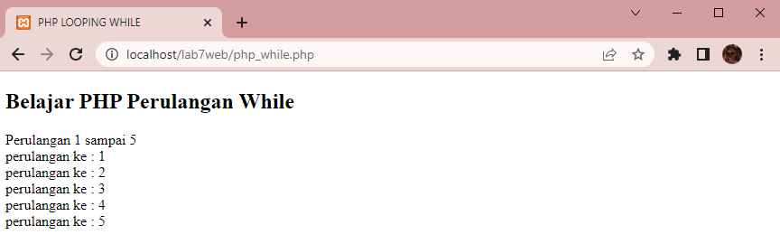
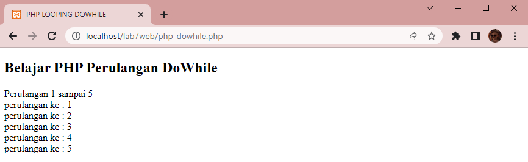

# Web7Lab7

**Nama    : Aning Kinanti** <br>
**NIM     : 312010364** <br>
**Kelas   : TI.20.A2** <br>
**Matkul  : Pemrograman Web** <br>

# Belajar PHP
1. Pastikan Xampp sudah terinstall dan server dapat berjalan dengan baik http://127.0.0.1 atau http://localhost
2. Tempatkan file website tempatkan di direktori: \xampp\htdocs\

## A. Pengenalan PHP
### 1. PHP Dasar
Buatlah dokumen PHP dengan nama php_dasar.php seperti contoh dibawah ini : <br>
```
<!DOCTYPE html>
<html lang="en">
<head>
    <meta charset="UTF-8">
    <meta http-equiv="X-UA-Compatible" content="IE=edge">
    <meta name="viewport" content="width=device-width, initial-scale=1.0">
    <title>PHP DASAR</title>
</head>
<body>
    <h1>Belajar PHP Dasar</h1>
    <?php
        echo "Hello Sunshine !";
    ?>
</body>
</html>
```
<br>

Kemudian untuk mengakses hasilnya melalui URL: http://localhost/lab7web/php_dasar.php <br>
Ini adalah hasil dari sintaks diatas :
 <br>

### 2. Variabel PHP
Tambahkan sintaks pada file php_dasar.php sebelumnya, dengan sintaks seperti contoh dibawah ini : <br>
```
    <h2>Menggunakan Variabel</h2>
    <?php
        $nim = "312010364";
        $nama = "Aning Kinanti";
        echo "NIM   : ". $nim . "<br>";
        echo "Nama  : $nama"; 
    ?>
```
<br>

Kemudian untuk mengakses hasilnya melalui URL: http://localhost/lab7web/php_dasar.php <br>
Ini adalah hasil dari sintaks diatas :
 <br>

### 3. Predefine Variable $_GET
Buatlah dokumen PHP dengan nama latihan2.php seperti contoh dibawah ini : <br>
```
<!DOCTYPE html>
<html lang="en">
<head>
    <meta charset="UTF-8">
    <meta http-equiv="X-UA-Compatible" content="IE=edge">
    <meta name="viewport" content="width=device-width, initial-scale=1.0">
    <title>PHP DASAR 2</title>
</head>
<body>
    <h2>Predefine Variabel</h2>
    <?php
        echo ' Selamat Datang ' . $_GET['nama'] ;
    ?>
</body>
</html>
```
<br>

Kemudian untuk mengakses hasilnya melalui URL: http://localhost/lab7web/latihan2.php?nama=aning <br>
Ini adalah hasil dari sintaks diatas :
 <br>

### 4. Membuat Form Input
Buatlah dokumen PHP dengan nama formInput.php seperti contoh dibawah ini : <br>
```
<!DOCTYPE html>
<html lang="en">
<head>
    <meta charset="UTF-8">
    <meta http-equiv="X-UA-Compatible" content="IE=edge">
    <meta name="viewport" content="width=device-width, initial-scale=1.0">
    <title>FORM INPUT</title>
</head>
<body>
    <h2>Form Input</h2>
    <form method="POST">
        <label>Nama : </label>
        <input type="text" name="nama">
        <input type="submit" value="kirim">
    </form>

    <?php
        echo ' Selamat Datang ' . $_POST['nama'] ;
    ?>
</body>
</html>
```
<br>

Kemudian untuk mengakses hasilnya melalui URL: http://localhost/lab7web/formInput.php <br>
Ini adalah hasil awal dari sintaks diatas :
 <br>

Kemudian masukan nama pada kolom input seperti dibawah ini : <br>
 <br>

Maka akan menjadi seperti dibawah ini : <br>
 <br>

### 5. Operator pada PHP
Buatlah dokumen PHP dengan nama php_operator.php seperti contoh dibawah ini : <br>
```
<!DOCTYPE html>
<html lang="en">
<head>
    <meta charset="UTF-8">
    <meta http-equiv="X-UA-Compatible" content="IE=edge">
    <meta name="viewport" content="width=device-width, initial-scale=1.0">
    <title>PHP OPERATOR</title>
</head>
<body>
   <h2>Belajar PHP Operator</h2>
   <?php
        $gaji = 1000000;
        $pajak = 0.1;
        $thp = $gaji - ($gaji*$pajak);
            echo "Gaji sebelum pajak = Rp. $gaji <br>";
            echo "Gaji yang dibawa pulang = Rp. $thp";
    ?>
</body>
</html>
```
<br>

Kemudian untuk mengakses hasilnya melalui URL: http://localhost/lab7web/php_operator.php <br>
Ini adalah hasil awal dari sintaks diatas :
 <br>

### 6. Kondisi IF pada PHP
Buatlah dokumen PHP dengan nama php_if.php seperti contoh dibawah ini : <br>
```
<!DOCTYPE html>
<html lang="en">
<head>
    <meta charset="UTF-8">
    <meta http-equiv="X-UA-Compatible" content="IE=edge">
    <meta name="viewport" content="width=device-width, initial-scale=1.0">
    <title>PHP IF</title>
</head>
<body>
   <h2>Belajar PHP Kondisi IF</h2>
   <?php
        $nama_hari = date("1");
        if ($nama_hari == "Sunday") {
            echo "Minggu";
        } elseif ($nama_hari == "Monday") {
            echo "Senin";
        } else {
            echo "Selasa";
        }
    ?>
</body>
</html>
```
<br>

Kemudian untuk mengakses hasilnya melalui URL: http://localhost/lab7web/php_if.php <br>
Ini adalah hasil awal dari sintaks diatas :
 <br>

### 7. Kondisi Switch pada PHP
Buatlah dokumen PHP dengan nama php_switch.php seperti contoh dibawah ini : <br>
```
<!DOCTYPE html>
<html lang="en">
<head>
    <meta charset="UTF-8">
    <meta http-equiv="X-UA-Compatible" content="IE=edge">
    <meta name="viewport" content="width=device-width, initial-scale=1.0">
    <title>PHP SWITCH</title>
</head>
<body>
    <h2>Belajar PHP Kondisi Switch</h2>
    <?php
    $nama_hari = date("1");
    switch ($nama_hari) {
        case "Sunday":
            echo "Minggu";
            break;
        case "Monday":
            echo "Senin";
            break;
        case "Tuesday":
            echo "Selasa";
            break;
        default :
            echo "Rabu";
    }  
    ?>
</body>
</html>
```
<br>

Kemudian untuk mengakses hasilnya melalui URL: http://localhost/lab7web/php_switch.php <br>
Ini adalah hasil awal dari sintaks diatas :
 <br>

### 8. Perulangan For pada PHP
Buatlah dokumen PHP dengan nama php_for.php seperti contoh dibawah ini : <br>
```
<!DOCTYPE html>
<html lang="en">
<head>
    <meta charset="UTF-8">
    <meta http-equiv="X-UA-Compatible" content="IE=edge">
    <meta name="viewport" content="width=device-width, initial-scale=1.0">
    <title>PHP LOOPING FOR</title>
</head>
<body>
    <h2>Belajar PHP Perulangan For</h2>
    <?php
    echo "Perulangan 1 sampai 5 <br />";
    for ($i=1; $i<=5; $i++) {
        echo "Perulangan ke:" . $i . '<br />';
    }
    echo "Perulangan Menurun dari 5 ke 1 <br />";
    for ($i=5; $i>=1; $i--) {
        echo "Perulangan ke: " . $i . '<br />';
    }
    ?>
</body>
</html>
```
<br>

Kemudian untuk mengakses hasilnya melalui URL: http://localhost/lab7web/php_for.php <br>
Ini adalah hasil awal dari sintaks diatas :
 <br>

### 9. Perulangan While pada PHP
Buatlah dokumen PHP dengan nama php_while.php seperti contoh dibawah ini : <br>
```
<!DOCTYPE html>
<html lang="en">
<head>
    <meta charset="UTF-8">
    <meta http-equiv="X-UA-Compatible" content="IE=edge">
    <meta name="viewport" content="width=device-width, initial-scale=1.0">
    <title>PHP LOOPING WHILE</title>
</head>
<body>
    <h2>Belajar PHP Perulangan While</h2>
    <?php
    echo "Perulangan 1 sampai 5 <br />";
    $i=1;
    while ($i<=5) {
        echo "perulangan ke : " . $i . '<br />';
        $i++;
    }
    ?>
</body>
</html>
```
<br>

Kemudian untuk mengakses hasilnya melalui URL: http://localhost/lab7web/php_while.php <br>
Ini adalah hasil awal dari sintaks diatas :
 <br>

### 10. Perulangan DoWhile pada PHP
Buatlah dokumen PHP dengan nama php_dowhile.php seperti contoh dibawah ini : <br>
```
<!DOCTYPE html>
<html lang="en">
<head>
    <meta charset="UTF-8">
    <meta http-equiv="X-UA-Compatible" content="IE=edge">
    <meta name="viewport" content="width=device-width, initial-scale=1.0">
    <title>PHP LOOPING DOWHILE</title>
</head>
<body>
    <h2>Belajar PHP Perulangan DoWhile</h2>
    <?php
    echo "Perulangan 1 sampai 5 <br />";
    $i=1;
    do {
        echo "perulangan ke : " . $i . '<br />';
        $i++;
    } while ($i<=5);
    ?>
</body>
</html>
```
<br>

Kemudian untuk mengakses hasilnya melalui URL: http://localhost/lab7web/php_dowhile.php <br>
Ini adalah hasil awal dari sintaks diatas :
 <br>

## B. Pernyataan dan Tugas
### 1.Buatlah program PHP sederhana dengan menggunakan form input yang menampilkan nama, tanggal lahir dan pekerjaan. Kemudian tampilkan outputnya dengan menghitung umur berdasarkan inputan tanggal lahir. Dan pilihan pekerjaan dengan gaji yang berbeda-beda sesuai pilihan pekerjaan ! <br>

Buatlah dokumen PHP dengan nama php_form.php seperti contoh dibawah ini : <br>
```
<!DOCTYPE html>
<html lang="en">
<head>
    <meta charset="UTF-8">
    <meta http-equiv="X-UA-Compatible" content="IE=edge">
    <meta name="viewport" content="width=device-width, initial-scale=1.0">
    <title>FORM INPUT</title>
</head>
<body>
    <h2>Data Diri</h2>
    <form method="POST">
        <fieldset>
        <legend>Form Input</legend>
        <p>
            <label>Nama :</label>
            <input type="text" name="nama" placeholder="Masukan Nama Anda" />
        </p>
        <p>
            <label>Tanggal Lahir :</label>
            <input type="date" name="tgl_lahir" />
        </p>
        <p>
            <label>Pekerjaan :</label>
            <select name="pekerjaan">
                <option value="Karyawan Swasta">Karyawan Swasta</option>
                <option value="Pegawai Negeri">Pegawai Negeri</option>
                <option value="Dan Lainnya">Dan Lainnya</option>
            </select>
        </p>
        <p>
            <label>Gaji :</label>
            <select name="gaji">
                <option value="1.000.000 s/d 3.000.000">1.000.000 s/d 3.000.000</option>
                <option value="3.000.000 s/d 6.000.000">3.000.000 s/d 6.000.000</option>
                <option value="6.000.000 s/d 9.000.000">6.000.000 s/d 9.000.000</option>
                <option value="Dan Lainnya">Dan Lainnya</option>
            </select>
        </p>
        <p>
            <input type="submit" name="submit" value="Kirim" />
        </p>
        </fieldset>
    </form>

    <fieldset>
    <legend>Report</legend>
    <?php
    $nama = $_POST['nama'];
    $tgl_lahir = $_POST['tgl_lahir'];
    $pekerjaan = $_POST['pekerjaan'];
    $gaji = $_POST['gaji'];

    $tanggal_lahir = new DateTime($_POST['tgl_lahir']);
    $sekarang = new DateTime("today");
    if ($tanggal_lahir > $sekarang) { 
    $umur = "0";
    }
    $umur = $sekarang->diff($tanggal_lahir)->y;
    
    echo "Nama = $nama <br>";
    echo "Umur = $umur tahun <br>";
    echo "Pekerjaan = $pekerjaan <br>";
    echo "Gaji = $gaji <br>";
    ?>
    </fieldset>
</body>
</html>
```
<br>

Kemudian untuk mengakses hasilnya melalui URL: http://localhost/lab7web/php_form.php <br>
Ini adalah hasil awal dari sintaks diatas :
 <br>

Kemudian isi data pada kolom input seperti dibawah ini : <br>
 <br>

Maka akan menjadi seperti dibawah ini : <br>
 <br>
