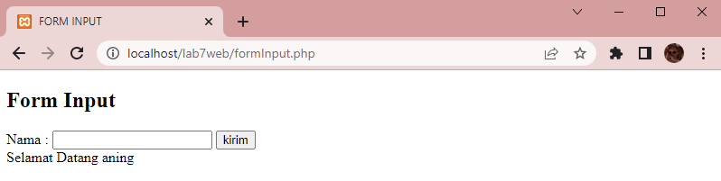

# Web7Lab7

**Nama    : Aning Kinanti** <br>
**NIM     : 312010364** <br>
**Kelas   : TI.20.A2** <br>
**Matkul  : Pemrograman Web** <br>

# Belajar PHP
    1. Pastikan Xampp sudah terinstall dan server dapat berjalan dengan baik http://127.0.0.1 atau http://localhost
    2. Tempatkan file website tempatkan di direktori: \xampp\htdocs\

## A. Pengenalan PHP
### 1. PHP Dasar
Buatlah dokumen PHP dengan nama php_dasar.php seperti contoh dibawah ini : <br>
```
<!DOCTYPE html>
<html lang="en">
<head>
    <meta charset="UTF-8">
    <meta http-equiv="X-UA-Compatible" content="IE=edge">
    <meta name="viewport" content="width=device-width, initial-scale=1.0">
    <title>PHP DASAR</title>
</head>
<body>
    <h1>Belajar PHP Dasar</h1>
    <?php
        echo "Hello Sunshine !";
    ?>
</body>
</html>
```
<br>

Kemudian untuk mengakses hasilnya melalui URL: http://localhost/lab7web/php_dasar.php <br>
Ini adalah hasil dari sintaks diatas :
 <br>

### 2. Variabel PHP
Tambahkan sintaks pada file php_dasar.php sebelumnya, dengan sintaks seperti contoh dibawah ini : <br>
```
    <h2>Menggunakan Variabel</h2>
    <?php
        $nim = "312010364";
        $nama = "Aning Kinanti";
        echo "NIM   : ". $nim . "<br>";
        echo "Nama  : $nama"; 
    ?>
```
<br>

Kemudian untuk mengakses hasilnya melalui URL: http://localhost/lab7web/php_dasar.php <br>
Ini adalah hasil dari sintaks diatas :
 <br>

### 3. Predefine Variable $_GET
Buatlah dokumen PHP dengan nama latihan2.php seperti contoh dibawah ini : <br>
```
<!DOCTYPE html>
<html lang="en">
<head>
    <meta charset="UTF-8">
    <meta http-equiv="X-UA-Compatible" content="IE=edge">
    <meta name="viewport" content="width=device-width, initial-scale=1.0">
    <title>PHP DASAR 2</title>
</head>
<body>
    <h2>Predefine Variabel</h2>
    <?php
        echo ' Selamat Datang ' . $_GET['nama'] ;
    ?>
</body>
</html>
```
<br>

Kemudian untuk mengakses hasilnya melalui URL: http://localhost/lab7web/latihan2.php?nama=aning <br>
Ini adalah hasil dari sintaks diatas :
 <br>

### 4. Membuat Form Input
Buatlah dokumen PHP dengan nama formInput.php seperti contoh dibawah ini : <br>
```
<!DOCTYPE html>
<html lang="en">
<head>
    <meta charset="UTF-8">
    <meta http-equiv="X-UA-Compatible" content="IE=edge">
    <meta name="viewport" content="width=device-width, initial-scale=1.0">
    <title>FORM INPUT</title>
</head>
<body>
    <h2>Form Input</h2>
    <form method="POST">
        <label>Nama : </label>
        <input type="text" name="nama">
        <input type="submit" value="kirim">
    </form>

    <?php
        echo ' Selamat Datang ' . $_POST['nama'] ;
    ?>
</body>
</html>
```
<br>

Kemudian untuk mengakses hasilnya melalui URL: http://localhost/lab7web/formInput.php <br>
Ini adalah hasil awal dari sintaks diatas :
 <br>

Kemudian masukan nama pada kolom input seperti dibawah ini : <br>
 <br>

Maka akan menjadi seperti dibawah ini : <br>
 <br>